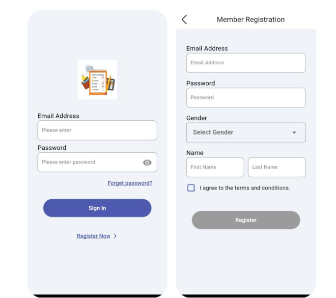
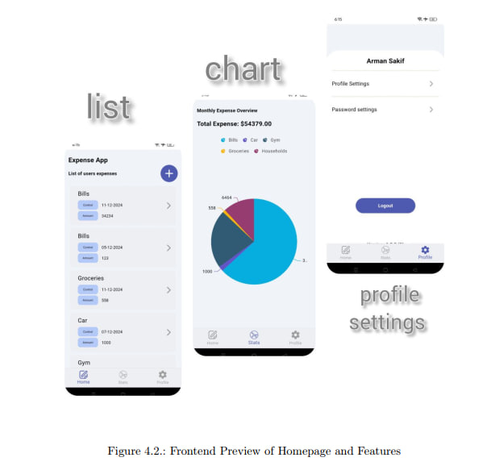

# 💸 Expense Manager – A Cross-Platform Personal Finance Tracker

**Expense Manager** is a cross-platform mobile application built using **Flutter**, powered by a **Python Flask** backend and hosted on **AWS**.  
The app helps users track, categorize, and visualize their personal expenses efficiently — with full-stack implementation as a learning showcase.

---

## 📱 Screenshots

 

---

## 🎯 Purpose

The goal of this project was twofold:
- 📱 To practically apply and sharpen my **Flutter** development skills by creating a real-world mobile application.
- 🌐 To understand and implement a complete **full-stack system** using **Flutter (frontend)**, **Python + Flask (backend)**, and **AWS services** (database, auth).

This app also serves as a personal expense tracking tool with real-time data sync and secure authentication.

---

## 📚 Learning Resources

This project was built with knowledge gained from completing the following courses:

1. `Flutter & Dart - The Complete Guide [2024 Edition]`
2. `Ultimate AWS Certified Solutions Architect Associate 2025`
3. `100 Days of Code: The Complete Python Pro Bootcamp`

---

## 🔍 Project Scope

### ✅ Frontend (Flutter + Dart)
- Intuitive, mobile-responsive UI.
- Add, categorize, and view expenses.
- Pie chart and list views for data visualization.

### ✅ Backend (Python + Flask)
- Custom REST APIs for:
  - Expense creation
  - Expense retrieval and filtering
- Secure API integration with frontend.

### ✅ AWS Services
- 🛢️ **PostgreSQL** for cloud data storage (via RDS)
- 🔐 **Cognito** for user authentication
- ☁️ **EC2 / Lambda** for backend hosting

---

## 🧠 Learning Outcomes

- Built a fully functional **full-stack app** from scratch.
- Applied course knowledge into practice (Flutter, Python, AWS).
- Designed a secure, scalable app with **real-time data sync**.
- Gained experience integrating multiple cloud-based tools and services.

---

## 🏗️ System Architecture
Flutter Frontend <-----> Python Flask API <-----> AWS PostgreSQL DB
|
+---> AWS Cognito (User Auth)

- **Frontend:** Flutter cross-platform mobile UI
- **Backend:** Python Flask API layer
- **Database:** AWS PostgreSQL (RDS)
- **Authentication:** AWS Cognito

---

## ⚙️ Features

| Feature                         | Description                                           |
| ------------------------------ | ----------------------------------------------------- |
| 🔐 User Authentication         | Sign up and log in securely via AWS Cognito          |
| 💾 Expense Entry               | Add amount, product name, and date                   |
| 📊 Expense Viewing             | View expenses in Pie Chart or List format            |
| 📆 Monthly Summary             | Auto-generated monthly breakdown of expenses         |
| 🔁 Real-Time Sync              | Seamless backend integration with live updates       |

---

